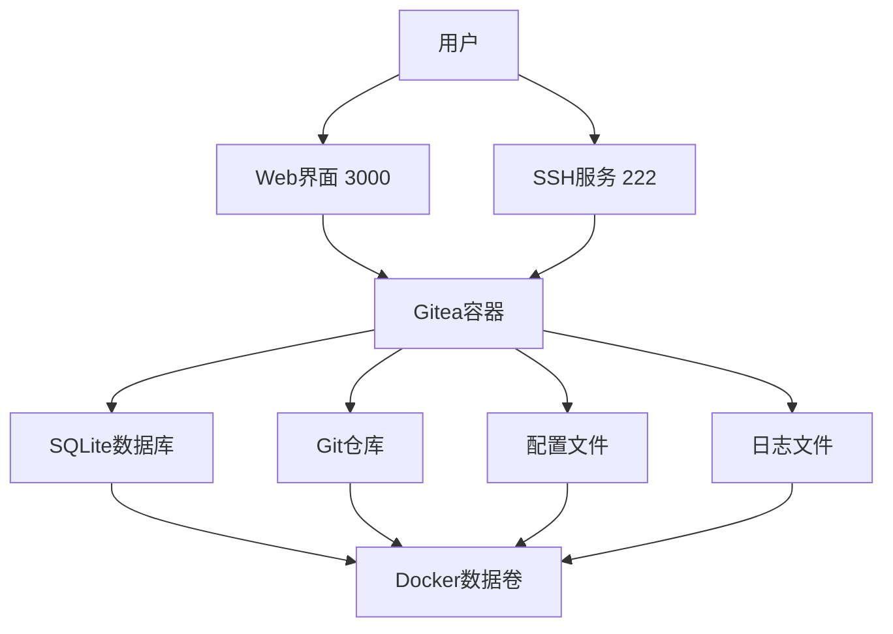

# Gitea Docker 私有Git服务

[](https://gitea.io)
[](https://docker.com)
[](LICENSE)

🚀 **完整的Gitea私有Git服务部署方案，包含安装、配置、迁移和维护工具**

## ✨ 特性

- ✅ **一键部署**: 5分钟快速启动
- ✅ **轻量高效**: 相比GitLab资源占用减少95%
- ✅ **数据安全**: 自动备份和迁移工具
- ✅ **完整文档**: 从安装到运维的全套指南
- ✅ **管理工具**: 便捷的管理和迁移脚本

## 🎯 快速开始

### 前提条件
- Docker 20.10+
- Docker Compose 1.29+
- 2GB+ 可用磁盘空间

### 5分钟启动
```bash
# 1. 克隆或下载项目文件
cd /path/to/gitea_install

# 2. 启动Gitea服务
docker-compose -f docker-compose-gitea.yml up -d

# 3. 查看服务状态
./manage-gitea.sh status

# 4. 访问Web界面
open http://localhost:3000
```

### 首次配置
1. 浏览器访问: http://localhost:3000
2. 选择数据库: SQLite3 (推荐)
3. 创建管理员账户
4. 完成安装

## 📚 文档导航

### 🚀 快速入门
| 文档 | 描述 | 适用人群 |
|------|------|----------|
| [快速开始指南](快速开始指南.md) | 5分钟部署指南 | 新手 |
| [Gitea使用指南](Gitea使用指南.md) | 用户使用手册 | 最终用户 |
| [常见问题FAQ](常见问题FAQ.md) | 问题排查手册 | 所有用户 |

### 🔧 技术文档
| 文档 | 描述 | 适用场景 |
|------|------|----------|
| [Gitea完整安装与迁移指南](Gitea完整安装与迁移指南.md) | 完整技术文档 | 深度配置 |
| [存储挂载详解](存储挂载详解.md) | 存储技术说明 | 存储管理 |
| [文档修复说明](文档修复说明.md) | 已知问题说明 | 问题解决 |

### 🛠️ 工具和脚本
| 脚本 | 功能 | 用法 |
|------|------|------|
| `manage-gitea.sh` | 服务管理脚本 | `./manage-gitea.sh {start|stop|restart|status|logs|update|backup}` |
| `migrate-gitea.sh` | 数据迁移脚本 | `./migrate-gitea.sh {export|import|backup|restore|verify}` |

### 📋 配置文件
| 文件 | 用途 | 描述 |
|------|------|------|
| `docker-compose-gitea.yml` | 服务配置 | Gitea主服务配置 |
| `docker-daemon.json` | Docker配置 | 镜像源配置 |
| `.env` | 环境变量 | 配置参数 |

## 🏗️ 系统架构



## 📊 功能对比

| 功能 | Gitea | GitLab | GitHub (私有) |
|------|-------|--------|---------------|
| 资源占用 | ~100MB | ~4GB+ | - |
| 部署复杂度 | 简单 | 复杂 | - |
| 启动时间 | ~30秒 | ~5-10分钟 | - |
| Git托管 | ✅ | ✅ | ✅ |
| 用户管理 | ✅ | ✅ | ✅ |
| CI/CD | 集成支持 | 内置 | Actions |
| 权限管理 | ✅ | ✅ | ✅ |
| 适合场景 | 个人/小团队 | 中大型企业 | 所有规模 |

## 🔄 工作流程

### 日常使用
```bash
# 启动服务
./manage-gitea.sh start

# 创建仓库 → 开发代码 → 提交推送

# 备份数据
./manage-gitea.sh backup
```

### 数据迁移
```bash
# 从机器A导出
./migrate-gitea.sh export user@machineA

# 在机器B导入
./migrate-gitea.sh import

# 验证数据
./migrate-gitea.sh verify
```

### 维护更新
```bash
# 检查状态
./manage-gitea.sh status

# 更新版本
./manage-gitea.sh update

# 查看日志
./manage-gitea.sh logs
```

## 🔒 安全特性

- 🔐 **权限控制**: 用户、组织、仓库三级权限
- 🔑 **SSH密钥**: 安全的代码访问
- 🛡️ **HTTPS支持**: SSL/TLS加密传输
- 📝 **审计日志**: 完整的操作记录
- 🔒 **数据加密**: 数据库敏感信息加密

## 🚀 性能优化

- ⚡ **轻量架构**: Go语言开发，性能优异
- 💾 **SQLite数据库**: 内置数据库，无需额外配置
- 📦 **Docker容器**: 隔离环境，资源可控
- 🗂️ **智能缓存**: 内存缓存提升响应速度

## 🌐 支持平台

- ✅ Linux (Ubuntu, CentOS, Debian)
- ✅ Windows (Docker Desktop)
- ✅ macOS (Docker Desktop)
- ✅ ARM64 (树莓派等)

## 📈 适用场景

### ✅ 推荐使用
- 个人代码托管
- 小团队协作开发
- 学习Git操作
- 内部项目托管
- CI/CD流水线

### ❌ 不推荐
- 大型企业级部署 (建议GitLab)
- 高并发场景
- 复杂的权限管理需求
- 大量存储需求

## 🤝 贡献指南

欢迎提交问题报告和改进建议！

1. 使用 Issues 报告问题
2. 提交 Pull Request 改进文档
3. 分享使用经验和最佳实践

## 📄 许可证

本项目采用 MIT 许可证 - 详见 [LICENSE](LICENSE) 文件

## 🔗 相关链接

- [Gitea官网](https://gitea.io/)
- [Gitea文档](https://docs.gitea.io/)
- [Docker官网](https://docker.com/)
- [Docker Compose文档](https://docs.docker.com/compose/)

---

## 🎉 开始使用

**准备好开始了吗？**

```bash
# 1. 启动服务
./manage-gitea.sh start

# 2. 访问界面
open http://localhost:3000

# 3. 创建第一个仓库
# 开始你的Git之旅！
```

**拥有自己的Git服务器，从未如此简单！** 🚀